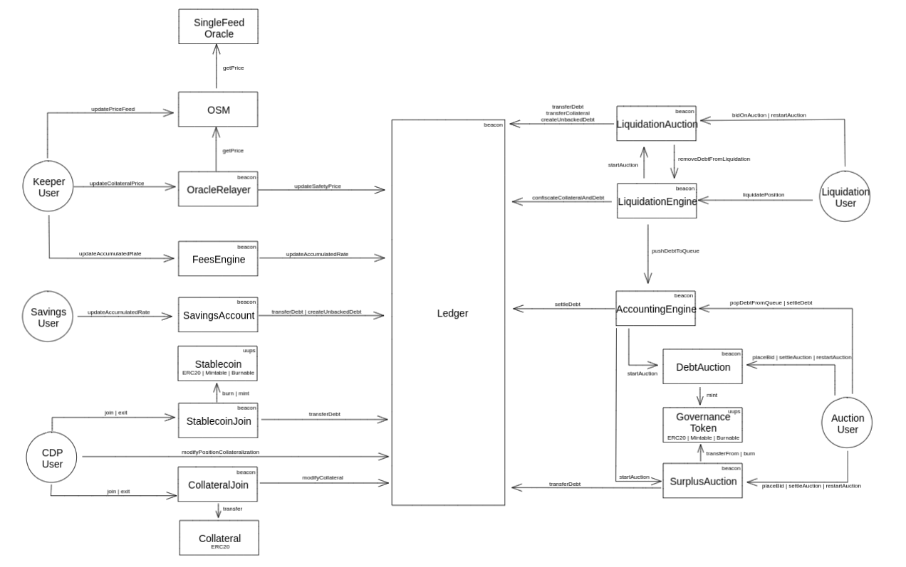

# @bluejayfinance/contracts

The repo contains all the smart contracts used for Bluejay Finance.

## Core Contracts

The core contracts are a fork of MakerDAO's CDP contracts, with some minor changes documented in the [transition document](./docs/NAMING_TRANSITION.md). The overall architecture of the contracts looks like:



## Deployment

A lite version of the core contracts can be deployed with a deployment plan. The easiest way to do that is to follow the instructions in the `app-vault` project. 

Once the contracts are deployed, you may need to manually update the price for the oracle. Since the price is behind an OSM, it will need to be updated, and then poked twice.

## Update Oracle Price

Update the price to 2000 MMK/USD by running the command below, the oracle address should be the value for `[MMKT][USDT]ProxyOracle` found in `src/fixtures/deployment/contracts.json` in the `app-vault` folder. 

```
hh updateOraclePrice --oracle-address 0xc351628EB244ec633d5f21fBD6621e1a683B1181 --price 2000000000000000000000 --network local
```

## Poke the Infrastructure

Poke the infrastructure twice to ensure that the oracle price is now reflected in the ledger. You will need the poker contract address which is the `[MMKT]Poker` value in `src/fixtures/deployment/contracts.json` in the `app-vault` folder. 

```
hh poke --poker-address 0xfaAddC93baf78e89DCf37bA67943E1bE8F37Bb8c --network local
```